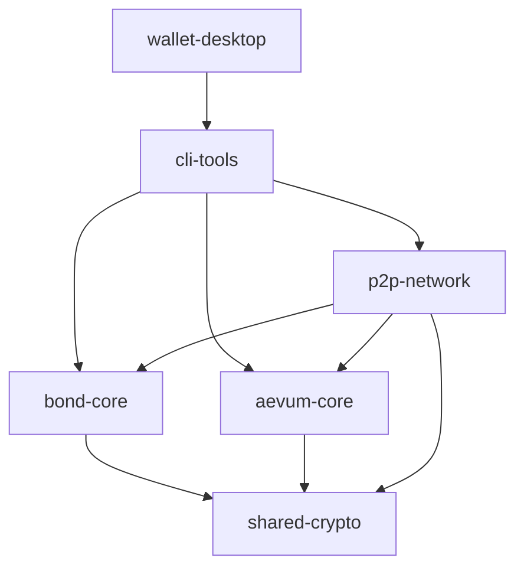

# 🔧 Development Guide - Aevum & Bond

## 🎯 Overview
Comprehensive development guide for contributing to the Aevum & Bond dual-ledger blockchain ecosystem.

## 📋 Prerequisites

### System Requirements
- **OS**: Linux (Ubuntu 20.04+), macOS (10.15+), or Windows with WSL2
- **CPU**: 64-bit processor, 4+ cores recommended
- **RAM**: 8GB minimum, 16GB recommended for development
- **Storage**: 50GB+ free space (SSD recommended)
- **Network**: Stable internet connection

### Development Tools

#### Core Tools
```bash
# Rust toolchain (required)
curl --proto '=https' --tlsv1.2 -sSf https://sh.rustup.rs | sh
rustup default stable
rustup component add clippy rustfmt

# Additional Rust tools
cargo install cargo-watch cargo-audit cargo-tarpaulin
cargo install cargo-expand cargo-tree cargo-outdated
```

#### Development Environment
```bash
# Git (version control)
sudo apt install git

# Build essentials (Linux)
sudo apt install build-essential pkg-config libssl-dev

# Protocol Buffers (for P2P networking)
sudo apt install protobuf-compiler

# Database tools (optional)
sudo apt install sqlite3
```

#### IDE Setup
**VS Code (Recommended)**
```bash
# Install VS Code
curl -fsSL https://code.visualstudio.com/sha/download?build=stable&os=linux-deb-x64 -o vscode.deb
sudo dpkg -i vscode.deb

# Install essential extensions
code --install-extension rust-lang.rust-analyzer
code --install-extension vadimcn.vscode-lldb
code --install-extension serayuzgur.crates
code --install-extension tamasfe.even-better-toml
```

**VS Code Configuration**
Create `.vscode/settings.json`:
```json
{
    "rust-analyzer.checkOnSave.command": "clippy",
    "rust-analyzer.cargo.features": "all",
    "editor.formatOnSave": true,
    "editor.codeActionsOnSave": {
        "source.fixAll": true
    },
    "[rust]": {
        "editor.defaultFormatter": "rust-lang.rust-analyzer",
        "editor.tabSize": 4
    },
    "files.exclude": {
        "**/target": true,
        "**/.git": true
    }
}
```

## 🏗️ Project Structure

### Workspace Layout
```
aevum-bond/
├── Cargo.toml              # Workspace configuration
├── Cargo.lock              # Dependency lock file
├── README.md               # Project overview
├── LICENSE                 # MIT license
├── .gitignore             # Git ignore rules
├── .github/               # GitHub workflows and templates
├── docs/                  # Documentation
├── scripts/               # Build and utility scripts
├── tests/                 # Integration tests
└── crates/
    ├── bond-core/         # Bond blockchain (PoW + pUTXO)
    ├── aevum-core/        # Aevum blockchain (PoD + Accounts)
    ├── shared-crypto/     # Post-quantum cryptography
    ├── p2p-network/       # Networking layer
    ├── cli-tools/         # Command-line interface
    └── wallet-desktop/    # Desktop wallet
```

### Crate Dependencies


## 🚀 Getting Started

### 1. Clone and Setup
```bash
# Clone the repository
git clone https://github.com/ozzyjob/Aevum-Bond.git
cd Aevum-Bond

# Check Rust installation
rustc --version
cargo --version

# Build the project
cargo build

# Run tests
cargo test --all
```

### 2. Development Environment
```bash
# Start development with file watching
cargo watch -x 'build' -x 'test'

# Or watch specific crate
cargo watch -p bond-core -x 'test'

# Format code
cargo fmt --all

# Check for issues
cargo clippy --all -- -D warnings
```

### 3. First Development Task
```bash
# Create a feature branch
git checkout -b feature/my-first-contribution

# Make changes and test
cargo test --package bond-core

# Commit changes
git add .
git commit -m "feat: add my first contribution"

# Push and create PR
git push origin feature/my-first-contribution
```

## 🔧 Development Workflow

### Daily Development Routine
```bash
# 1. Sync with latest changes
git pull origin main

# 2. Start development server
cargo watch -x 'clippy --all -- -D warnings' -x 'test --all'

# 3. Make changes and test continuously
# Files are automatically checked on save

# 4. Before committing
cargo fmt --all
cargo clippy --all -- -D warnings
cargo test --all

# 5. Commit with conventional commits
git commit -m "feat(bond-core): add new mining algorithm"
```

### Code Quality Checks
```bash
# Complete quality check script
#!/bin/bash
set -e

echo "🔍 Running quality checks..."

# Format check
echo "📝 Checking code format..."
cargo fmt --all -- --check

# Linting
echo "🔧 Running clippy..."
cargo clippy --all -- -D warnings

# Tests
echo "🧪 Running tests..."
cargo test --all

# Security audit
echo "🔒 Running security audit..."
cargo audit

# Check for outdated dependencies
echo "📦 Checking dependencies..."
cargo outdated

echo "✅ All checks passed!"
```

## 🏗️ Architecture Overview

### Bond Chain Development
**Core Components:**
```rust
// bond-core/src/lib.rs
pub mod block;          // Block structure and validation
pub mod transaction;    // Transaction handling
pub mod consensus;      // Proof of Work consensus
pub mod mining;         // Mining algorithms
pub mod utxo;          // UTXO set management
pub mod mempool;       // Transaction pool
```

**Key Concepts:**
- **UTXO Model**: Unspent Transaction Output tracking
- **Proof of Work**: SHA-3 based mining
- **Difficulty Adjustment**: Dynamic targeting
- **Double-Spend Prevention**: UTXO validation

### Aevum Chain Development
**Core Components:**
```rust
// aevum-core/src/lib.rs
pub mod account;        // Account-based model
pub mod consensus;      // Proof of Delegation
pub mod validator;      // Validator management
pub mod state;         // World state management
pub mod gas;           // Gas metering system
pub mod contract;      // Smart contract execution
```

**Key Concepts:**
- **Account Model**: Balance and nonce tracking
- **Proof of Delegation**: Stake-based consensus
- **Smart Contracts**: EVM-compatible execution
- **State Management**: Merkle Patricia Trie

### Shared Cryptography
**Components:**
```rust
// shared-crypto/src/lib.rs
pub mod signature;      // Post-quantum signatures
pub mod hash;          // Hash functions (SHA-3)
pub mod keypair;       // Key generation and management
pub mod address;       // Address derivation
pub mod merkle;        // Merkle tree operations
```

## 🧪 Testing Strategy

### Test Categories

#### 1. Unit Tests
```rust
#[cfg(test)]
mod tests {
    use super::*;

    #[test]
    fn test_block_creation() {
        let block = Block::new(vec![], [0u8; 32], 1234567890);
        assert!(block.is_valid());
    }

    #[tokio::test]
    async fn test_async_operation() {
        let result = perform_async_operation().await;
        assert!(result.is_ok());
    }
}
```

#### 2. Integration Tests
```rust
// tests/integration_test.rs
use aevum_bond::*;

#[tokio::test]
async fn test_full_blockchain_flow() {
    let mut blockchain = Blockchain::new();
    
    // Create and add block
    let block = create_test_block();
    blockchain.add_block(block).await.unwrap();
    
    // Verify blockchain state
    assert_eq!(blockchain.height(), 1);
}
```

#### 3. Property-Based Tests
```rust
use proptest::prelude::*;

proptest! {
    #[test]
    fn test_transaction_roundtrip(
        tx in arbitrary_transaction()
    ) {
        let serialized = bincode::serialize(&tx)?;
        let deserialized: Transaction = bincode::deserialize(&serialized)?;
        prop_assert_eq!(tx, deserialized);
    }
}
```

#### 4. Benchmark Tests
```rust
use criterion::{black_box, criterion_group, criterion_main, Criterion};

fn benchmark_mining(c: &mut Criterion) {
    c.bench_function("mine_block", |b| {
        b.iter(|| {
            let block_template = black_box(create_block_template());
            mine_block(block_template, DIFFICULTY)
        })
    });
}

criterion_group!(benches, benchmark_mining);
criterion_main!(benches);
```

### Running Tests
```bash
# All tests
cargo test --all

# Specific crate
cargo test --package bond-core

# Specific test
cargo test test_block_validation

# With output
cargo test -- --nocapture

# Integration tests only
cargo test --test integration_tests

# Benchmarks
cargo bench

# Coverage report
cargo tarpaulin --out Html
```

## 🔍 Debugging

### Debugging Tools
```bash
# Debug build for better debugging
cargo build

# Run with debugging
RUST_LOG=debug cargo run

# Memory debugging with Valgrind
cargo install cargo-valgrind
cargo valgrind run

# Address sanitizer
RUSTFLAGS="-Z sanitizer=address" cargo run

# Thread sanitizer
RUSTFLAGS="-Z sanitizer=thread" cargo run
```

### Logging Configuration
```rust
use tracing::{info, warn, error, debug, trace};
use tracing_subscriber;

// Initialize logging
tracing_subscriber::fmt::init();

// Use in code
debug!("Processing transaction: {:?}", tx_hash);
info!("Block {} mined successfully", block_number);
warn!("High memory usage detected: {}MB", memory_mb);
error!("Failed to validate block: {}", error);
```

### VS Code Debugging
Create `.vscode/launch.json`:
```json
{
    "version": "0.2.0",
    "configurations": [
        {
            "type": "lldb",
            "request": "launch",
            "name": "Debug bond-core tests",
            "cargo": {
                "args": [
                    "test",
                    "--no-run", 
                    "--package=bond-core"
                ],
                "filter": {
                    "name": "bond-core",
                    "kind": "lib"
                }
            },
            "args": [],
            "cwd": "${workspaceFolder}"
        }
    ]
}
```

## 📊 Performance Optimization

### Profiling
```bash
# Install profiling tools
cargo install cargo-flamegraph
cargo install cargo-profdata

# Generate flamegraph
cargo flamegraph --bin aevum-bond

# Profile with perf
cargo build --release
perf record --call-graph=dwarf ./target/release/aevum-bond
perf report
```

### Optimization Guidelines
1. **Use `cargo build --release` for benchmarks**
2. **Profile before optimizing**
3. **Prefer `Vec` over `LinkedList`**
4. **Use `Box` for large stack allocations**
5. **Consider `Arc` vs `Rc` for sharing**
6. **Minimize allocations in hot paths**

### Memory Management
```rust
// Prefer stack allocation
let data = [0u8; 32];

// Use Box for large objects
let large_data = Box::new(LargeStruct::new());

// Use Arc for shared ownership
let shared_data = Arc::new(expensive_computation());

// Use Cow for conditional cloning
use std::borrow::Cow;
fn process_data(data: Cow<str>) {
    // Works with both owned and borrowed data
}
```

## 🔐 Security Considerations

### Secure Coding Practices
```rust
// Always validate inputs
fn process_transaction(tx: &Transaction) -> Result<(), Error> {
    if tx.inputs.is_empty() {
        return Err(Error::InvalidTransaction("No inputs"));
    }
    
    // Validate each input
    for input in &tx.inputs {
        validate_input(input)?;
    }
    
    Ok(())
}

// Use constant-time comparisons for sensitive data
use subtle::ConstantTimeEq;

fn secure_compare(a: &[u8], b: &[u8]) -> bool {
    a.ct_eq(b).into()
}

// Clear sensitive data from memory
use zeroize::Zeroize;

struct PrivateKey([u8; 32]);

impl Drop for PrivateKey {
    fn drop(&mut self) {
        self.0.zeroize();
    }
}
```

### Cryptographic Guidelines
1. **Use established libraries**: `pqcrypto`, `sha3`
2. **Implement constant-time algorithms**
3. **Clear sensitive data from memory**
4. **Validate all cryptographic inputs**
5. **Use secure random number generation**

## 📚 Documentation

### Code Documentation
```rust
/// Validates a blockchain transaction.
///
/// This function performs comprehensive validation of a transaction,
/// including signature verification, UTXO checks, and amount validation.
///
/// # Arguments
///
/// * `transaction` - The transaction to validate
/// * `utxo_set` - The current UTXO set for validation
///
/// # Returns
///
/// * `Ok(())` if the transaction is valid
/// * `Err(ValidationError)` if validation fails
///
/// # Examples
///
/// ```
/// use bond_core::{Transaction, UTXOSet, validate_transaction};
/// 
/// let tx = Transaction::new(/* ... */);
/// let utxo_set = UTXOSet::new();
/// 
/// match validate_transaction(&tx, &utxo_set) {
///     Ok(()) => println!("Transaction is valid"),
///     Err(e) => println!("Validation failed: {}", e),
/// }
/// ```
///
/// # Security Considerations
///
/// This function performs cryptographic signature verification.
/// Ensure that the UTXO set is trusted and up-to-date.
pub fn validate_transaction(
    transaction: &Transaction,
    utxo_set: &UTXOSet,
) -> Result<(), ValidationError> {
    // Implementation...
}
```

### Generate Documentation
```bash
# Generate and open documentation
cargo doc --open

# Generate documentation for all dependencies
cargo doc --document-private-items --open

# Generate documentation without dependencies
cargo doc --no-deps --open
```

## 🛠️ Useful Scripts

### Development Scripts
Create `scripts/dev.sh`:
```bash
#!/bin/bash
# Development helper script

case "$1" in
    "setup")
        echo "Setting up development environment..."
        rustup component add clippy rustfmt
        cargo install cargo-watch cargo-audit
        ;;
    "test")
        echo "Running comprehensive tests..."
        cargo test --all --verbose
        ;;
    "check")
        echo "Running quality checks..."
        cargo fmt --all -- --check
        cargo clippy --all -- -D warnings
        cargo audit
        ;;
    "clean")
        echo "Cleaning build artifacts..."
        cargo clean
        rm -rf target/
        ;;
    *)
        echo "Usage: $0 {setup|test|check|clean}"
        exit 1
        ;;
esac
```

### Build Scripts
Create `scripts/build.sh`:
```bash
#!/bin/bash
# Build script for different configurations

BUILD_TYPE=${1:-debug}

case "$BUILD_TYPE" in
    "debug")
        echo "Building debug version..."
        cargo build --all
        ;;
    "release")
        echo "Building release version..."
        cargo build --all --release
        ;;
    "test")
        echo "Building for testing..."
        cargo build --all --tests
        ;;
    *)
        echo "Usage: $0 {debug|release|test}"
        exit 1
        ;;
esac
```

## 🤝 Collaboration

### Git Workflow
```bash
# Start new feature
git checkout main
git pull origin main
git checkout -b feature/my-feature

# Make changes
git add .
git commit -m "feat: add new feature"

# Keep up to date
git fetch origin
git rebase origin/main

# Push changes
git push origin feature/my-feature

# Create pull request via GitHub UI
```

### Code Review Checklist
- [ ] Code compiles without warnings
- [ ] All tests pass
- [ ] Code follows style guidelines
- [ ] Documentation is adequate
- [ ] Security considerations addressed
- [ ] Performance impact considered
- [ ] Breaking changes documented

## 📈 Continuous Integration

### GitHub Actions
Our CI pipeline runs:
1. **Format Check**: `cargo fmt --check`
2. **Linting**: `cargo clippy -- -D warnings`
3. **Tests**: `cargo test --all`
4. **Security Audit**: `cargo audit`
5. **Build**: `cargo build --release`

### Local CI Simulation
```bash
# Run the same checks as CI
./scripts/ci-check.sh
```

---

**Happy coding! 🚀**

**Development Guide Version**: 1.0.0  
**Last Updated**: September 27, 2025  
**Status**: Ready for Development ✅
