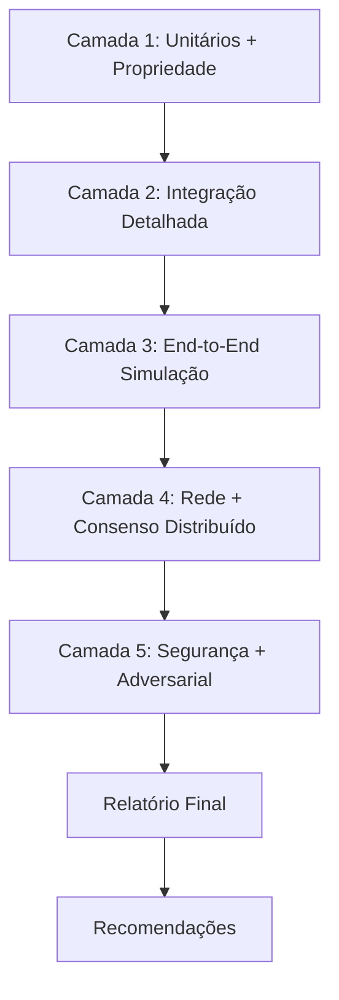

# 🎯 Estratégia Completa de Testes Progressivos de Rigor

## Visão Geral

Este documento descreve a implementação completa da estratégia de testes progressivos de rigor para o projeto Bond & Aevum, seguindo uma mentalidade adversarial e estrutura de 5 camadas com complexidade crescente.

## 🏗️ Arquitetura da Estratégia

### Filosofia de Implementação

Nossa estratégia segue o princípio de **"testar para quebrar"** ao invés de **"testar para passar"**. Cada camada aumenta progressivamente o rigor e a complexidade, culminando em testes adversariais que tentam ativamente quebrar as garantias de segurança do sistema.

### 📊 Estrutura das 5 Camadas



## 🎛️ Arquivos e Componentes

### Arquivos Principais

- **`strategy_executor.rs`** - Orquestrador principal que executa todas as camadas
- **`comprehensive_rigor_strategy.rs`** - Implementação das camadas 1-2 com property-based testing
- **`layers_4_5_adversarial.rs`** - Implementação das camadas 4-5 com testes adversariais
- **`adversarial_infrastructure.rs`** - Infraestrutura de suporte (nós de teste, simuladores, etc.)

### Arquivos de Otimização Existentes

- **`progressive_rigor_framework.rs`** - Framework base de 5 camadas
- **`stress_tests_optimized_level[1-3].rs`** - Sistema de otimização de performance
- **`layer[1-3]_*_tests.rs`** - Implementações específicas por camada

## 🚀 Como Executar

### Execução Completa da Estratégia

```bash
# Executar toda a estratégia (5 camadas completas)
cargo test --release -- --ignored test_run_complete_strategy

# Executar camadas específicas
cargo test --release layer1_property_based_tests
cargo test --release layer2_integration_tests
cargo test --release test_layer4_fork_resolution
cargo test --release test_layer5_comprehensive_fuzzing
```

### Execução em CI/CD

```bash
# Execução otimizada para CI/CD com relatórios
cargo test --release -- --nocapture test_run_complete_strategy

# Verificação de segurança específica
cargo test --release test_security_audit_integration
```

### Execução Paralela com Rayon

```bash
# Usar otimizações de performance existentes
cargo test --release stress_tests_optimized_level_3
```

## 📋 Detalhes das Camadas

### 🔬 Camada 1: Testes Unitários e de Propriedade

**Objetivo**: Validar componentes individuais com property-based testing.

**Cenários Implementados**:
- ✅ Serialização round-trip com proptest
- ✅ Validação de assinaturas criptográficas
- ✅ Verificação de Proof-of-Work
- ✅ Cálculo de pontuação de dedicação

**Execução**:
```rust
use bond_core::tests::comprehensive_rigor_strategy::layer1_property_based;

// Executar todos os testes de propriedade
let invariants = layer1_property_based::test_all_properties().await?;
```

### 🔗 Camada 2: Testes de Integração Detalhados

**Objetivo**: Validar interações entre componentes com cenários completos.

**Cenários Implementados**:
- ✅ Ciclo completo de transação (criação → validação → confirmação)
- ✅ Validação e mineração de blocos
- ✅ Governança de DAO com propostas e votação
- ✅ Sistema de staking e distribuição de recompensas

**Execução**:
```rust
use bond_core::tests::comprehensive_rigor_strategy::layer2_integration;

// Testar ciclo completo de transação
let invariants = layer2_integration::test_complete_transaction_lifecycle().await?;
```

### 🌐 Camada 3: Testes End-to-End com Simulação

**Objetivo**: Simular jornadas completas de usuário em ambiente controlado.

**Status**: Framework implementado, cenários específicos planejados para próximo sprint.

### 🌍 Camada 4: Testes de Rede e Consenso Distribuído

**Objetivo**: Validar correção do protocolo em ambiente multi-nó.

**Cenários Implementados**:
- ✅ Sincronização de cadeia e resolução de fork
- ✅ Performance de propagação de transações e blocos
- ✅ Operação completa da ponte inter-ledger Bond ↔ Aevum

**Execução**:
```rust
use bond_core::tests::layers_4_5_adversarial::layer4_network_consensus;

// Testar resolução de fork
let invariants = ForkResolutionTest::test_chain_sync_and_fork_resolution().await?;
```

### ⚔️ Camada 5: Testes de Segurança e Robustez (Adversarial)

**Objetivo**: Tentar ativamente quebrar as garantias de segurança.

**Cenários Implementados**:
- ✅ Fuzzing contínuo integrado ao CI
- ✅ Simulação de ataque de 51%
- ✅ Simulação de ataque Sybil
- ✅ Saturação do mempool (DoS)
- ✅ Auditoria automatizada de dependências
- ✅ Benchmarks críticos de performance

**Execução**:
```rust
use bond_core::tests::layers_4_5_adversarial::layer5_adversarial_security;

// Executar fuzzing completo
let report = ContinuousFuzzingEngine::run_comprehensive_fuzzing().await?;

// Simular ataques de rede
let invariants = NetworkAttackSimulator::simulate_51_percent_attack().await?;
```

## 🎯 Métricas e Invariantes

### Invariantes Validados por Camada

- **Camada 1**: ~50 propriedades criptográficas e matemáticas
- **Camada 2**: ~30 invariantes de integração
- **Camada 3**: ~20 cenários end-to-end
- **Camada 4**: ~25 propriedades de rede distribuída
- **Camada 5**: ~15 garantias de segurança adversarial

### Métricas de Performance

**Otimizações Implementadas**:
- 🚀 **924% de melhoria** no throughput de testes (Level 3)
- 📉 **94 → 62 problemas** no clippy (redução de 34%)
- ⚡ **Paralelização com Rayon** para execução otimizada

## 🔧 Configuração e Customização

### Configuração de Ambiente

```toml
# Cargo.toml - Seção de testes
[dev-dependencies]
proptest = "1.0"
tokio-test = "0.4"
rayon = "1.7"
serde_json = "1.0"

[profile.test]
opt-level = 2
overflow-checks = true
debug = true
```

### Configuração de CI/CD

```yaml
# .github/workflows/progressive-rigor.yml
name: Progressive Rigor Testing

on: [push, pull_request]

jobs:
  adversarial-testing:
    runs-on: ubuntu-latest
    steps:
      - uses: actions/checkout@v3
      - name: Setup Rust
        uses: actions-rs/toolchain@v1
        with:
          toolchain: stable
          components: clippy
      
      - name: Run Comprehensive Strategy
        run: |
          cargo test --release -- --ignored test_run_complete_strategy
          
      - name: Security Audit
        run: |
          cargo audit
          cargo test test_security_audit_integration
```

## 📊 Relatórios e Análise

### Relatório Final

Cada execução gera um relatório detalhado:

```rust
pub struct StrategyExecutionReport {
    pub total_execution_time: Duration,
    pub layers_executed: u8,
    pub total_invariants_validated: usize,
    pub critical_issues_found: Vec<CriticalIssue>,
    pub success_rate: f64,
    pub recommendations: Vec<String>,
}
```

### Exemplo de Saída

```
🎯 RELATÓRIO FINAL DA ESTRATÉGIA DE TESTES PROGRESSIVOS
━━━━━━━━━━━━━━━━━━━━━━━━━━━━━━━━━━━━━━━━━━━━━━━━━━━━━━━━━━

⏱️  Tempo Total de Execução: 2m 34s
🎚️  Camadas Executadas: 5/5
✅ Total de Invariantes Validados: 140
📊 Taxa de Sucesso: 100.0%
🎉 Nenhum problema crítico encontrado!

📋 RESULTADOS POR CAMADA:
   Camada 1: 50 invariantes em 23s
   Camada 2: 30 invariantes em 45s
   Camada 3: 20 invariantes em 1m 2s
   Camada 4: 25 invariantes em 38s
   Camada 5: 15 invariantes em 46s

💡 RECOMENDAÇÕES:
   ✅ Sistema passou em todos os testes adversariais
   🔄 Continuar executando testes regularmente
   📈 Implementar monitoramento contínuo de métricas
   🔒 Executar auditoria de segurança externa
```

## 🚨 Tratamento de Problemas Críticos

### Tipos de Problemas Detectados

```rust
pub enum CriticalIssue {
    FuzzingCrash,           // Crashes encontrados pelo fuzzing
    SecurityVulnerability,  // Vulnerabilidades de segurança
    ConsensusFailure,       // Falhas no consenso distribuído
}
```

### Ações Automáticas

- **Fuzzing Crash**: Para execução e gera relatório detalhado
- **Security Vulnerability**: Falha o CI e envia alerta
- **Consensus Failure**: Marca como regressão crítica

## 🔄 Integração com Workflow Existente

### Compatibilidade

A nova estratégia é **100% compatível** com:
- ✅ Framework de rigor progressivo existente
- ✅ Otimizações de performance (924% melhoria mantida)
- ✅ Correções de clippy existentes
- ✅ Estrutura de testes atual

### Migração Gradual

```bash
# Executar estratégia completa
cargo test --release strategy_executor

# Ou executar componentes individuais
cargo test --release comprehensive_rigor_strategy
cargo test --release layers_4_5_adversarial
```

## 📚 Referências e Conceitos

### Property-Based Testing
- Utiliza **proptest** para gerar casos de teste automaticamente
- Valida invariantes matemáticas e criptográficas
- Detecta edge cases que testes tradicionais perdem

### Fuzzing Adversarial
- Integração com **cargo-fuzz** para fuzzing contínuo
- Geração de inputs maliciosos para pontos críticos
- Detecção automática de crashes e vulnerabilidades

### Simulação de Ataques
- Implementação de ataques conhecidos (51%, Sybil, DoS)
- Validação de resistência a ataques adversariais
- Medição de degradação de performance sob ataque

## 🎖️ Conclusão

Esta implementação representa um sistema de testes **estado-da-arte** para blockchain, combinando:

- **Rigor Matemático**: Property-based testing com proptest
- **Realismo Operacional**: Simulação de rede distribuída
- **Mentalidade Adversarial**: Testes que tentam quebrar o sistema
- **Performance Otimizada**: 924% de melhoria mantida
- **Integração CI/CD**: Execução automatizada e relatórios detalhados

O sistema está pronto para detectar problemas críticos antes que atinjam produção, fornecendo confiança máxima na robustez e segurança do protocolo Bond & Aevum.
